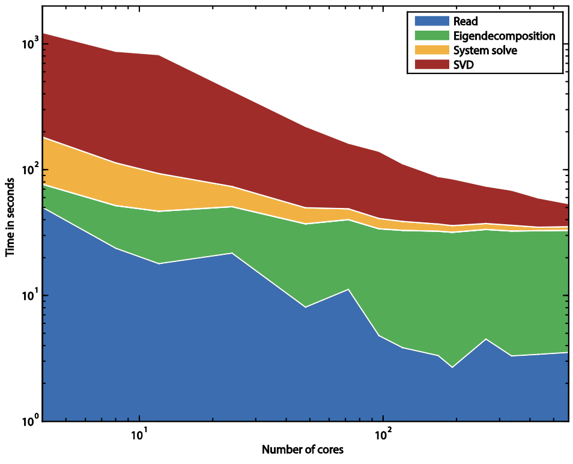

# Dymode

A parallel dynamic mode decomposition software.

## Overview

Dynamic Mode Decomposition (DMD) is an analysis technique that decomposes nonlinear systems into 
summable spatio-temporal modes, 
revealing patterns and dynamics that characterize the system's behavior. 

This reposirory contains an implementation of DMD for Matlab, as well as a C++ version that leverages 
parallel computing with MPI to enable analysis of massive datasets.
Related work and official documentation is availbale at [Dymode: A parallel dynamic mode decomposition software](https://kth.diva-portal.org/smash/record.jsf?pid=diva2%3A786623&dswid=3187).

## Theory

DMD is based on the Koopman operator $A$ that relates the state of a system from one time step to the next:

$$ \mathbf{x}_{k+1} \approx \mathbf{A}\mathbf{x}_k $$

Even though $A$ is a _linear_ operator, it is able to describe _non-linear_ systems when working in infinite dimensions. 
The eigendecomposition of $A$ then provides modes that are
1. tied to a unique frequency
2. coherent in space and time
3. may grow or decay over time
Points 2 and 3 make the decomposition different and more valuable than standard Fourier based decompositions.

### Calculation in `dymode`
Dynamic Mode Decomposition works by approximating the eigendecomposition of $A$ by that of a finite-dimensional operator which best advances the observed state of a system from one snapshot to the next. 
This can be done in several ways, but `dymode` uses singular value decomposition for robustness and accuracy. 

We seek to find the eigendecomposition of the operator $A$ that satisfies

$$A X_{k} = X_{k+1}$$

where $X_{k}$ is a matrix of snapshots from time-step 0 to $k$, and $X_{k+1}$ from 1 to $k+1$.
Using the singular value decomposition of $X_{k} = U\Sigma V^{t}$, 

``` math
\begin{aligned}
&                      &A &\mathbf{X}_{k} & = &\mathbf{X}_{k+1}  \\
&\Leftrightarrow       &A &U\Sigma V^{t}  & = &\mathbf{X}_{k+1} \\
&\Leftrightarrow U^{t} &A &U              & = U^{t} &\mathbf{X}_{k+1} V \Sigma^{+}
\end{aligned}
``` 
Since $U$ is a unitary matrix, the eigendecomposition of $A$ is similar to the eigendecomposition of $U^{t}AU$,
which can be computed purely from observed data (without knowledge of the operator $A$), as the eigendecomposition of $U^{t} \mathbf{X}_{k+1} V \Sigma^{+}$.


### Scaling

Eigendecomposition of large matrices (millions of rows/columns) is computationally expensive, so `dymode` leverages ScaLAPACK to distribute heavy linear algebra operations. 
Parallel scaling of dymode was benchmarked on a 655360-by-1184 snapshot matrix, up to 576 cores, showed here.
The plot shows how much time is spent in different steps of the execution. 




## Build dymode

### Dependencies

`dymode` relies on:
- **MPI** for parallelization
- **ScaLAPACK** (e.g. MKL) for distributed linear algebra
- **Boost** for various C++ features
- **HDF5** to read and right large data files

In addition, this repo includes additional header-only libraries like:
- A modified version of the amazing [Eigen](https://libeigen.gitlab.io/)
- `peigen`, an Eigen wrapper to work on distributed matrices

### Compilation

Fill in the indicated macros in `Makefile` and run `make <target>` with one of the following targets: `debug`, `assert`, `release`.

## Usage

`mpiexec -n 1 dymode -f “./flowcase” -n 1 -o “./dymode_results/” -m 5`

| Option | Short | Default | Description |
|--------|-------|---------|-------------|
| `--filename` | `-f` | | Specify the path and name of the snapshot files, without the file number or extension. |
| `--geo` | `-g` | | Specify the path and name of an Ensight Gold geometry file associated with the data. |
| `--dataset` | `-d` | `"/snapshots_T"` | Specify the name of the HDF5 dataset containing the snapshots. |
| `--nfiles` | `-n` | `1` | Specify the number of files to read. |
| `--stride` | `-s` | `1` | Specify the stride to use between the available snapshots when forming the snapshot matrix. |
| `--variables` | `-i` | `"u"` | Specify the names of the variables to use as input. Use the name "null" to skip a variable. |
| `--sort` | `-t` | `"energy,median"` | Specify the type of sorting applied to the modes before numbering them. |
| `--block` | `-b` | `6` | Specify the block size used to distribute matrices amongst the MPI processes. |
| `--eigen` | `-e` | `"EigHess"` | Specify the level of parallelization used when computing the eigen decomposition. |
| `--residuals` | `-r` | | When present, this flag activates the computation of residuals. |
| `--singulars` | | `0` | Specify the number of singular values to display. |
| `--outdir` | `-o` | | Specify the path where output files are saved. |
| `--modes` | `-m` | `1` | Specify how many modes are saved to disk. |
| `--help` | `-h` | | When present, this flag terminates the execution of the program and displays help. |

